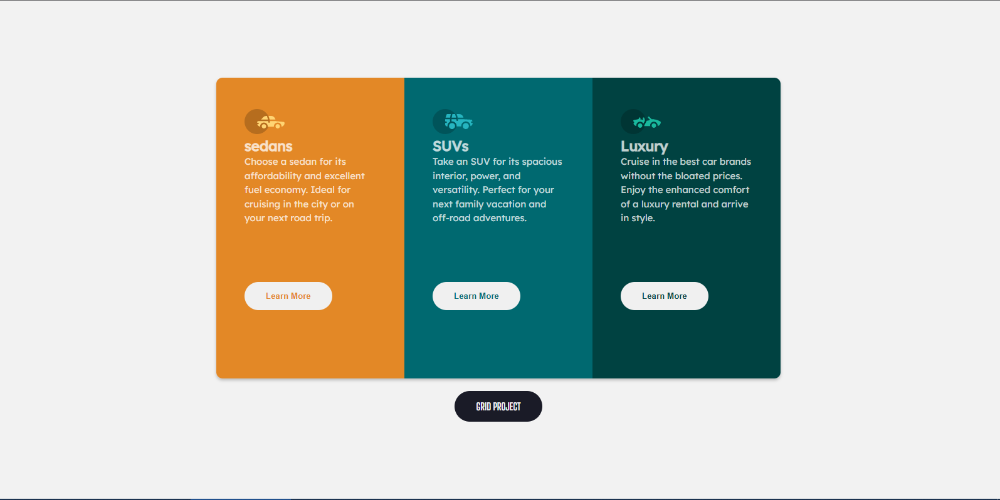
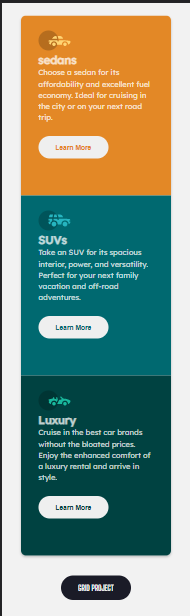
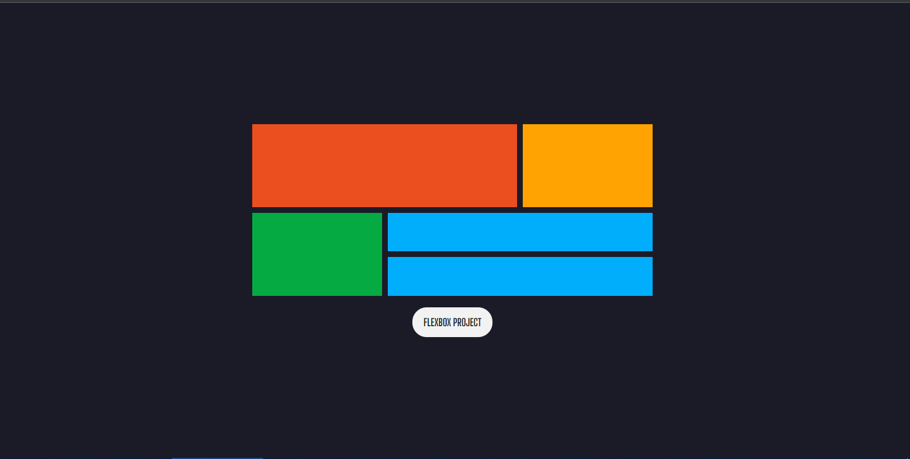

# WEEK 4 task - CSS cont

## Description

- This project involves the use of Flexbox and Grid layout to build responsive websites

## Images

# Task a

# Task b

## Built with

- Semantic HTML5 markup
- CSS custom properties
- Flexbox and Grid

## Author

- Website - [Bright Odohofre](https://Odohofre.github.io)
- Twitter - [@B_Odohofre](https://www.twitter.com/B_Odohofre)
